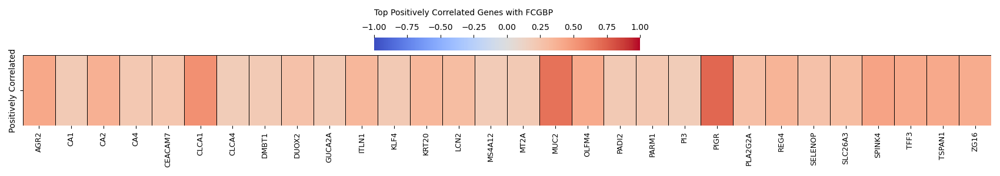
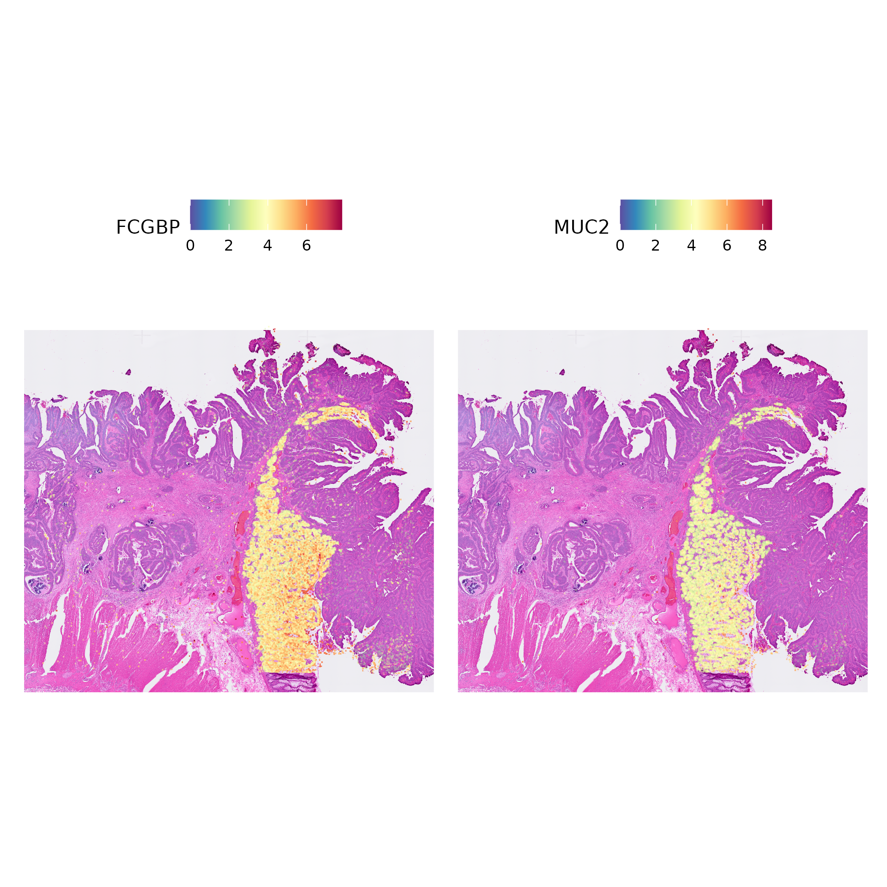

# Visium HD Basic Analysis of Colorectal Cancer

This repository contains the analysis of high-definition spatial transcriptomics data from colorectal cancer samples using the Visium HD platform. The analysis focuses on exploring gene expression patterns, marker identification, and spatial clustering in colorectal cancer tissue using custom pipeline, Seurat (R), and Scanpy (Python). The data can be downloaded from the [10X's website](https://www.10xgenomics.com/products/visium-hd-spatial-gene-expression/dataset-human-crc). 

## Project Overview

This project analyzes spatial transcriptomics data from colorectal cancer samples using Seurat, Scanpy, and custome method. The analysis includes clustering, differential expression analysis, and correlation studies.

## Repository Structure

- `p2_crc_visium_hd_Seurat.ipynb`: Main analysis notebook for Visium HD data processing using Seurat
- `p2_crc_correlated_genes.ipynb`: Analysis of gene correlations in Python
- `Figures/`: Directory containing visualization outputs
- `OutputFiles/`: Directory containing analysis outputs

## Key Findings and Visualizations

### 0. High Resolution Image of the Visium Slide

### 1. Spatial Clustering Analysis

*Lovian clustering of colorectal cancer tissue showing distinct molecular regions*

### 2. FCGBP Correlation Analysis

*Overview of genes correlated with FCGBP expression*

#### Detailed Correlation Analysis

*Genes positively correlated with FCGBP*

*Genes negatively correlated with FCGBP*

### 3. Colon Marker Analysis

*Co-expression patterns of normal colon markers*

*Down-regulated markers in normal colon tissue*

## Getting Started

### Prerequisites
- Python 3.1
- Jupyter Notebook
- Seurat
- Scanpy

### Usage
1. Clone this repository
2. Install required dependencies
3. Open and run the Jupyter notebooks in order:
   - First run `p2_crc_visium_hd_Seurat.ipynb`
   - Then run `p2_crc_correlated_genes.ipynb`

## Data Processing

The analysis workflow includes:
1. Data preprocessing and quality control (minimal, follow legacy workflows for detailed analysis)
2. Spatial clustering analysis (using Louvian Algorith)
3. Correlation analysis focusing on FCGBP
3. Morphological Marker gene identification (Based on Gene Expression Correlation; Use FindMarkers in Seurat for finding markers for specific clusters.)
5. Visualization of spatial patterns

## Contributing

Feel free to fork this repository and submit pull requests. For major changes, please open an issue.
